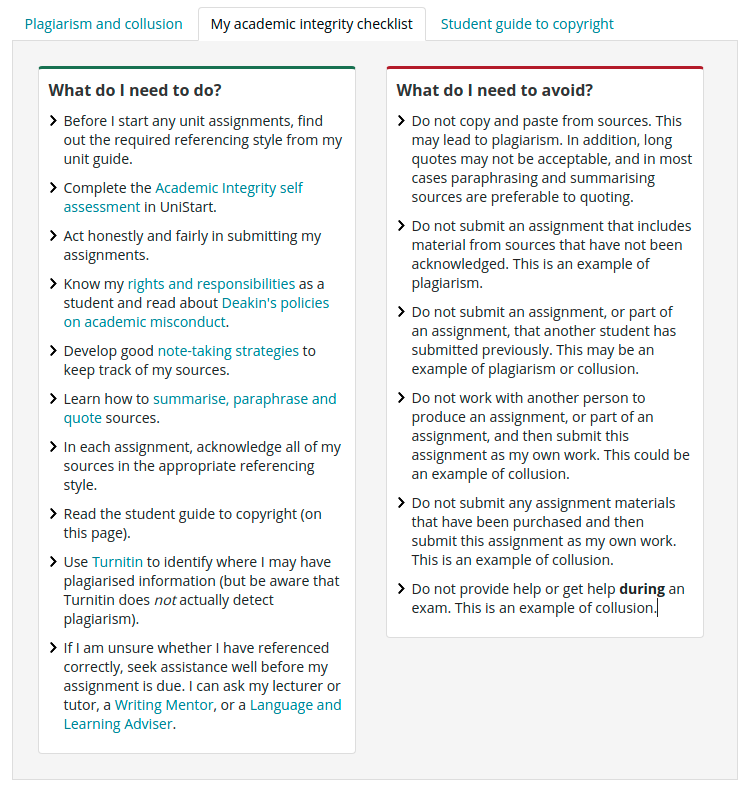
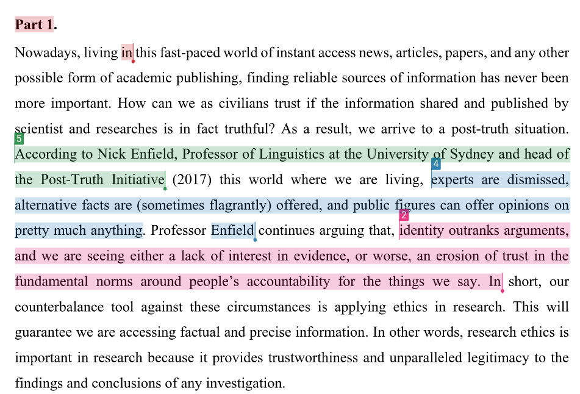

## 1.1 What is research and why do we do it?

When did you last research something?
A lot of the time we are doing it without realising it.
For example when we are deciding on which phone to buy we will do some research about the features, cost etc.
When planning a vacation we might do some research about the attractions in the area and whether the accommodation has the features we need.
In short, research is the search for knowledge or truth.
In our day to day lives, research consists of finding information/knowledge that already exists, but in the scientific sense research is a search for new knowledge. 

There are various sources of information we can use, from books and magazines, to web-based articles, scientific journals as well as experts in the field.
Scientists undertake experiments, observe phenomena, perform simulations and analyse data in order to create this new knowledge.
These research activities may be undertaken by private companies, universities or government departments, but all contribute to advancing human progress.

Research is incredibly important for a number of reasons.
One could argue that the phenomenal increase in living quality and life expectancy over the past 200 years was driven mostly due to advancements stemming from research. 

* Sanitation and public health

* Maternal and infant mortality

* Industrial agriculture

* Medicines such as antibiotics

* Telecommunications and the world wide web

In addition to this, research together with journalism and public discourse sets the “common truths” which a society can agree upon.
Without a common set of facts with which we collectively assume are true, it is difficult for society to progress in any meaningful way.
For example, if climate change is not recognised in the discourse (media) as a serious threat, then there is little chance of there being legislative change to avert carbon pollution.

There is now a great awareness that false information is a threat to this common set of truths.
Indeed some commentators are saying we have entered a post-truth era, defined as an environment where facts are less influential in shaping public opinion than emotional appeals.

Misinformation is described as the process by which individuals or media spread false information without checking the veracity of such information.
Disinformation is defined as those with vested interests deliberately spreading misleading information to their own benefit. 

The rise of the internet has resulted in a shrinking of the mainstream media (think newspapers, TV, public broadcasting, investigative journalism) in favour of forums that pander to peoples preconceived attitudes.
This results in a divide between people with different points of view and could lead to fragmentation of the social fabric.
Unfortunately, in the era of social media, false information tends to spread faster than the truth.

Therefore it is incredibly important that objective research continues to collect the true knowledge, and the scientific enterprise is involved in the communication of this knowledge not only in the form of journal articles and books, but actively participating in the public discourse and engagement.
Science and research need to be recognised as a public good and source of future wealth and wellbeing, and a factor in the decision making process at all levels of government.
This engagement needs to cater to all age groups and demographics, but with special emphasis on children/young people who will be the leaders and influencers of the future.

For example if the public at large are familiar with the biology of how viruses spread, they might be more willing to support and comply with public health measures like mask wearing and vaccination.
Certainly now, the evidence is pointing to the fact that science education is among the most important predictors for success in controlling COVID-19.
In summary, order for us to surmount the major challenges ahead of us as a society we need to have both a healthy research sector but also give young people a solid scientific education and continue this education process through life with ongoing scientific communication and engagement.

## 1.2 How is scientific research conducted?

Epistemology is the branch of philosophy concerned with knowledge. How is it that we recognise some information as true or false?
Let’s recognise that science is built upon observations, facts and verification. In this regard, opinions, beliefs, faith and emotions do not matter. The scientific process begins with a person making some preliminary observations that lead them to a new idea or paradigm we call a “hypothesis”. At that point, the hypothesis may or may not be true, so it requires further investigation. Experiments, data collection and analysis are required to test conclusively whether this new idea is true or false. This step is called “falsification” and is one of the pillars of epistemology and modern scientific thinking and was popularised by philosopher Karl Popper (Popper 1974). 

One of the other important notions by Popper is that the absence of evidence is not the evidence of absence.
He gave an example that one could theorise that all swans were white if they only saw white swans in their life, but upon seeing a black swan for the first time the idea could be disproven and overturn the prevailing theory.
This emphasizes that there are certain things that science may not be able to assess.
Therefore, if a proposed idea cannot be verified with experimentation, then it is not in the realm of science and might rightly be derided as pseudoscience or metaphysics. 

The main thesis of Popper is that science is the summarisation of complex observations and patterns into simpler sets of rules.
This tends to work wonderfully in the “hard science” fields of physics, chemistry and to some extent biology and genetics, but less so for complex systems like human behaviour and sociology.

Thomas Kuhn on the other hand had a more pragmatic approach, saying that as a scientist we cannot verify everything by ourselves.
Once facts are established they don’t need to be repeatedly verified unless there is some new doubt that arises about the veracity (Kuhn 1970).
For example, if we know that heavy metals are toxic from animal studies and that high levels of heavy metals exposure in people are associated with toxicity, then it is unnecessary to undertake a intervention based trial on humans to establish the toxicity of such metals (it would also be highly unethical; more on that later).

To Kuhn, scientific research is a undertaking characterised by a systematic approach to the generation of new knowledge, building on previous work yet subjecting it to close scrutiny to determine any failings.
He emphasized that results must be substantiated and work must be reproducible.
By “substantiate”, we mean that all assertions need to be supported by data. By “reproducible” the simple definition is that these experiments would be repeated by an independent research group with similar outcomes.

There is another school of thought that limiting scientific research to falsification will stifle original discoveries and that an emphasis on creativity, careful observation and questioning is needed.
In a recent article by David Glass (2010), he puts forward the idea that we should be framing scientific endeavours around open ended questions rather than strict and limited hypotheses. 

David Glass. Source: FSHD Society; https://www.fshdsociety.org/about-us/our-team/david-glass/

Some of the reasons for this approach include:

* Researchers might ignore striking data leading to new ideas if they “filter” it through a predetermined hypothesis.

* Although Popper states that science is based on falsification, the real goal of science is to verify facts and theories.
For example, how many journal articles have you read that support the null hypothesis?

* If researchers are limited to proposing research projects that have a defined yes/no answer with a high probability of success - what we call incremental research - then where will the next ground-breaking discoveries be made?

* Big data collection and sharing in and of itself is a valid exercise, as the research community as a whole will make new discoveries based on this substrate.

It is highly recommended you read David Glass’s article which can be downloaded for free (open access; see the references). 

You should keep in mind this content and ideas when you are preparing your research proposal and designing experiments for Assessment Task 2.

## 1.3 What types of research are there?

The Australian Research Council (ARC) and National Health and Medical Council (NHMRC) have devised a system of classification of research.
This helps those agencies to monitor what type of research work is funded and ensures that the research funding profile is aligned to the mission of the agencies and needs of the country.
You will also need to quote the codes which best describe your research proposal as a part of Assessment Task 2.
You can find these codes at the ARC Website (https://www.arc.gov.au/grants/grant-application/classification-codes-rfcd-seo-and-anzsic-codes).

Please note that most, if not all research projects these days are multidisciplinary, so that there will not be one code that totally encapsulates the research activity, it will probably consist of three to five different codes.

### 1.3.1 Types of activity

There are four classifications according to the Australian Research Council (ARC) by type of activity (TOA). The following is quoted from the ABS (Australian Bureau of Statistics, 2008).

1. Pure basic research is experimental and theoretical work undertaken to acquire new knowledge without looking for long term benefits other than the advancement of knowledge. For example:

    * The discovery of the gene editing technology called CRISPR/Cas9 was based on “blue sky” research on how bacteria protect themselves from infection from phages (small viruses) but has since revolutionised how genetics is done and is finding new applications in medicine.

    * Research into particle physics or astronomy.

2. Strategic basic research is experimental and theoretical work undertaken to acquire new knowledge directed into specified broad areas in the expectation of useful discoveries.
It provides the broad base of knowledge necessary for the solution of recognised practical problems. For example:

    * Research into how climate change is going to impact forest communities, plant health and growth.

    * Research into what genes/mutations predispose to a higher risk of heart disease.

3. Applied research is original work undertaken primarily to acquire new knowledge with a specific application in view.
It is undertaken either to determine possible uses for the findings of basic research or to determine new ways of achieving some specific and predetermined objectives. For example:

    * Studying the ecology of wildlife in a particular area that are vulnerable/threatened/endangered could be informative to how to protect and manage habitat and species.

    * A plant pathologist investigating a new outbreak of plant disease in crops.

    * An engineer trialing different compositions of photovoltaic cells in order to obtain better solar energy efficiency.

4. Experimental development is systematic work, using existing knowledge gained from research or practical experience, that is directed to producing new materials, products or devices, to installing new processes, systems and services, or to substantially improving those already produced or installed.

    * In the field of civil engineering and construction, using recent research results in steel and concrete to optimise building strength and lower cost.

    * An agronomist who is testing the optimum amount of fertiliser for crop yield.

    * A geneticist who is developing a commercial kit for the early diagnosis of cancer based on existing genetic knowledge.

These classifications are important because you will need to provide the TOA for the proposed research project you describe in Assessment Task 2. 

We sometimes need to describe our own research as a breakdown. For example:

* Pure Basic Research: 20%

* Strategic Basic Research: 30%

* Applied Research: 10%

* Experimental Development: 40%

### 1.3.2 Field of research

Field of research (FOR) classification is simple in that it divides research by the discipline(s) required to undertake it.
There are different levels of aggregation, for example in the field of chemistry, there are multiple specific disciplines like analytical, organic, forensic, etc.
Have a look at how aquaculture is classified.

| Field of research (FOR) | Discipline |
| --- | --- |
| 30 | Agricultural and veterinary sciences |
| 3005 | Fisheries sciences |
| 300501 | Aquaculture |

Information about these codes is given at the ARC website (https://www.arc.gov.au/grants/grant-application/classification-codes-rfcd-seo-and-anzsic-codes).
You will see that the codes underwent a restructure in 2020, so it is important to state which set of codes you are using when you are quoting these numbers, for the aquaculture example above, Aquaculture is FOR070401 for 2008 and FOR300501 for 2020.
Please check that you are using the 2020 codes when completing assessment task 2.
Note again that for most research projects, there are likely to be somewhere like two to five fields of research and it is important to list the relative fraction that will be the focus of the research for example: 50% Aquaculture, and 50% Physiology.

### 1.3.3 Socioeconomic objectives

Lastly, we have the socioeconomic objectives (SEO).
These are designed to define the benefit or impact of the research work outside of the narrow perspective of academic achievement.
In the example provided by Peter Macreadie in earlier years, he describes a project looking at how microbes are important in the sequestration of CO2.
He listed the SEOs as follows:

| Socioeconomic Objective | Percentage |
| --- | --- | 
| 961404 - Coastal and Estuarine Soils | 50% |
| 900302 - Climate Change Mitigation Strategies | 30% |
| 960503 - Ecosystem Assessment and Management of Coastal and Estuarine Environments | 20%| 

It is important that you consider these SEOs carefully for your proposal in Assessment Task 2 as there are marks allocated to the expected outcomes and benefits of the proposed research project.

## 1.4 Academic and research integrity and incentives

As a Deakin student you are well aware of the rules around academic integrity, in that you need to submit your own work, cannot plagiarise others, cannot let others complete the work on your behalf and must not assist others to circumvent these rules.
You have likely been under pressure of multiple deadlines and upcoming exams causing you lots of stress and maybe you have been tempted to cut corners in your work by bending the rules or outright disobeying them.
We know that 99% of students do the right thing most of the time, but there’s that 1% that pose a big threat to the system at large.

The same type of temptations exist in the world of research.
We might think of scientists as 100% trustworthy and ethical, however under the pressure of multiple incentives, there are a small fraction of researchers that regularly bend the rules or engage in research misconduct.

Research is like many other professions in that our achievement and progress is measured by our outputs.
For example how many research articles were published, how many grant applications were funded and how many patents were awarded.
In many research fields the main metric that is measured is the Journal Impact Factor of the journal where the research articles are published.
By publishing lots of high impact papers and getting media coverage, they can attract more research funds to support the team of researchers and give themselves a higher chance of getting that next promotion or landing a higher paying position at another employer.
This is true not only for senior researchers, but also junior researchers who feel pressure from their supervisors to undertake a set of experiments and collect data quickly as the results may influence whether the junior researcher’s employment contract is extended.

So as you can see, the incentives as they currently stand promote publishing lots of “high impact” papers, rather than a smaller number of very robust works.
This focus on “numbers over quality” is one reason why the scientific literature contains so many poor articles.
This is also the main argument of Nobel Laureate William Kaelin in his 2017 article titled “Publish houses of brick, not mansions of straw” (Kaelin 2017) which is well worth a read.

This also extends to writing, and there are multiple cases of plagiarism in the scientific literature where it  appears that passages of text, and sometimes larger sections are copied verbatim. As you know plagiarism occurs in the world of research and in academic coursework.

Let’s now move on to defining what these research integrity standards are.

## 1.5 Integrity standards in research

In Australia, the most important document guiding the conduct of researchers is the Australian Code for the Responsible Conduct of Research, 2018 (The National Health and Medical Research Council, 2018).
It is a relatively short document at only six pages of text so it is worth reading it in your study time.
It outlines the principles of responsible research conduct, as well as the responsibilities of institutions and individual researchers.
There are many principles and responsibilities of researchers, but I will expand upon those which are most related to the AT1 essay. 

### 1.5.1 Honesty and integrity in data collection and rigour

| Research Integrity |
| --- |
| P1: Honesty in the development, undertaking and reporting of research. Present information truthfully and accurately in proposing, conducting and reporting research. |
| P2: Rigour in the development, undertaking and reporting of research. Underpin research by attention to detail and robust methodology, avoiding or acknowledging biases. |
| P3 Transparency in reporting research methodology, data and findings. Share and communicate research methodology, data and findings openly, responsibly and accurately. |
| R23: Disseminate research findings responsible, accurately and broadly. Where necessary, take action to correct the record in a timely manner. |

P1, P2 and R23 stipulate that researchers need to conduct themselves with honesty and rigour in their professional work and disseminate accurate research findings.
Researchers need to conduct the experiments and collect data honestly.
They are not allowed to change any of the recorded measurement values.
They are not allowed to fabricate or “make up” any data.
They are not allowed to exclude any samples or data points unless this is done in a systematic fashion and the rationale for doing so must be described in the lab notebook and journal article.

There are also cases where scientists decide to undertake sloppy work because of lack of time/resources, or because the additional work might invalidate the collected data.
On this note Glenn Begley outlines six red flags for suspect work in the realm of preclinical biomedical science (Begley 2013):

1. Were experiments performed blinded?

2. Were basic experiments performed with replicates?

3. Were all the results shown?

4. Were there positive and negative controls?

5. Were the reagents validated?

6. Were the appropriate statistical analysis used?

### 1.5.2 Accountability and responsibility for data retention

| Data Retention |
| --- | 
| P7 Accountability for the development, undertaking and reporting of research. Comply with relevant legislation, policies and guidelines. | 
| R8 Institutions must provide access to facilities for the safe and secure storage and management of  research data, records and primary materials and, where possible and appropriate, allow access and reference.|
| R22 Researchers must retain clear, accurate, secure and complete records of all research including research data and primary materials. Where possible and appropriate, allow access and reference to these by interested parties. |

Researchers are accountable for collecting data and ensuring it is safely stored at the institution.
Saving the data only on a hard drive at home is not acceptable.
This includes laboratory notebooks and any electronic files.
The Institution needs to provide data storage facilities like archiving of notebooks and storage of electronic files.
It is the responsibility of the researchers to ensure data is properly stored and can be provided to anyone who is investigating the integrity of a particular piece of research.
The NHMRC provides more detailed guidelines for data storage in their document “Management of Data and Information in Research - A guide supporting the Australian Code for the Responsible Conduct of Research”.
It is a relatively short document, so you should take the time to read it.
Some of the more important parts are that generally, researchers are required to retain research data for 5 years from the date of publication.
There are some exceptions to this rule, for example clinical trial data needs to be retained for 15 years.
If the work involves gene therapy or has some community, cultural or historic value, the data needs to be retained indefinitely.
There are also considerations around participant privacy which we will cover in future weeks.
Also, the lab notebooks remain the property of the institution so you cannot take the physical book from the premises.
If you want to keep a personal copy it is up to you to scan the book.
There is a growing trend towards electronic notebooks, and these must also comply with data retention.

### 1.5.3 Fairness in authorship decisions

| Authorship | 
| --- | 
| P4 Fairness in the treatment of others … including Give credit, including authorship where appropriate, to those who have contributed to the research. |
| R25 Ensure that authors of research outputs are all those, and only those, who have made a significant intellectual or scholarly contribution to the research and its output, and that they agree to be listed as an author. |
| R26 Acknowledge those who have contributed to the research. |

As authorship of journal articles is used as evidence of research output, these can be highly influential in a researcher's future career direction.
Therefore it comes as no surprise that many disagreements arise around who should be listed as an author and where in the list their name appears.
For example, being listed first indicates that they conducted most of the experiments and drafted the manuscript.
Being listed last indicates that they were the project supervisor, and perhaps conceived the idea in the first place.
Being listed in the middle means that this person provided an important contribution to the experiments, data, analysis, or method development but wasn’t the biggest contributor.
If the contribution is smaller and doesn’t fit the definition of “significant intellectual contribution” then authorship is not appropriate.
In those cases an acknowledgement at the end of the article recognising the person’s contribution is recommended.
This acknowledgement can only be included if the individual has given their permission.
Such contributions could be:

* Provides materials to the research team such as reagents, samples, equipment, protocol, software code or funding.

* Performs a small amount of experimental or analytical work contributing to the project (eg <8hr).

* Reads and provides critical comments on a draft.

Because there are no hard limits for what “significant” actually means there is a great deal of ambiguity.
This means that the threshold for authorship may vary between research institutions and even between groups in the same institute.
To avoid such disagreements from occurring in the first place it is always recommended to discuss authorship arrangements before the work is undertaken, especially if it is a collaboration involving >3 individuals or more than one research team.
These discussions should be recorded in writing, for example saved emails and in the lab notebook too.
Journals may also have guidelines for qualifying as an author.
Also note that a person’s rank or credentials does not preclude them from authorship.
For example it doesn’t matter if the work was done by a professor, undergraduate student or citizen scientist without an academic degree, if it constitutes a significant intellectual input then they should qualify for authorship.
Further guidance is given in the document “Authorship: A guide supporting the Australian Code for the Responsible Conduct of Research” which again is a short (6 page) document which you should refer to in your essay for assessment task 1.

### 1.5.4 Disclosing conflicts of interest

| Transparency |
| --- |
| P3 Transparency in declaring interests ... Disclose and manage conflicts of interest (COI) |
| R24 Disclose and manage actual, potential or perceived conflicts of interest | 

If a researcher has a direct financial interest in the outcome of the research it can be classified as a conflict of interest.
This means that the researcher could benefit if the research results give a particular outcome.
For example, if the research team has a patent for a device which could be considered highly valuable then this is a conflict of interest which should be declared whenever the team publishes research findings of the device.
Another example is when a clinical scientist receives research funding or consultation fees from a pharmaceutical company, and the researcher studies the effects of drugs produced by the pharmaceutical company.
These above cases are called “actual” conflicts of interest because the researcher receives a direct benefit from the other party.

“Potential” conflicts are those where the researcher does not receive any direct benefit now, but could at some point in the future.
For example if the research was funded by an industry partner and the industry partner might benefit in future from the research findings, then it could be classified as a potential conflict of interest.

“Perceived” conflicts are those where the researcher is unlikely to receive any benefit from the arrangement/activity but from outside observers one might conclude there could be a conflict.
For example, where a genetics researcher (or someone close to them) holds a large amount of shares (or stock) of a company that supplies genome sequencing instruments/consumables. 

These points above may not be significant if you are an entry level researcher, but as you develop and become involved in different organisations and business deals they become more important to disclose.
Additional guidance is given in the document “Disclosure of interests and management of conflicts of interest: A guide supporting the Australian Code for the Responsible Conduct of Research” which you might refer to in your essay in AT1.

## 1.6 How is research integrity different from research ethics?

These are related concepts but in this unit we will make a strong distinction.
We define research integrity as the things we have defined above, including honesty, accountability and transparency.
We define research ethics as whether a particular project or experiment is morally justified.
In later weeks we will take a closer look at research ethics as it applies to animal experimentation and projects involving human participants.
There are other branches of research ethics for example research which might be used against people or the environment, for example weapons technology, facial or speech recognition, gain of function pathogen experiments, etc.

It is crucially important that you understand the difference between these concepts and address each in assessment task 1 essay if appropriate.
For example if your research area is psychology then you will need to discuss both research integrity and research ethics (human participants), but if your research area is in physics (which doesn’t involve animal or human experimentation), then you will need to focus on research integrity.

## 1.7 How is research integrity monitored?

The Australian Code for the Responsible Conduct of Research, 2018 (The National Health and Medical Research Council, 2018) sets out the different ways in which research integrity (and ethics) are to be monitored.
The most important way research integrity is monitored is by the ways more senior staff are involved in training, guiding and mentoring research trainees such as students and junior staff.
As described in point R15, the supervisor (or lab head) is responsible that the research being conducted in that group is scientifically sound and the findings are reported accurately.
The supervisor should monitor the conduct of their group members and undertake checks of the underlying data, such as lab notebooks and electronic files to verify that mistakes haven’t been made.
Point R29 states that researchers have a responsibility to report breaches of the code if they believe one has taken place.
This could be within the same group or department or could be an allegation that something is fishy with research published by another research group.

Institutions also have a major role to play in monitoring research integrity as demonstrated by several responsibilities in the Code:

* R1 Establish and maintain good governance and management practices for responsible research conduct.

* R2 Identify and comply with relevant laws, regulations, guidelines and policies related to the conduct of research.

* R3 Develop and maintain the currency and ready availability of a suite of policies and procedures which ensure that institutional practices are consistent with the principles and responsibilities of the Code.

* R4 Provide ongoing training and education that promotes and supports responsible research conduct for all researchers and those in other relevant roles.

* R5 Ensure supervisors of research trainees have the appropriate skills, qualifications and resources.

* R6 Identify and train Research Integrity Advisors who assist in the promotion and fostering of responsible research conduct and provide advice to those with concerns about potential breaches of the Code.

* R9 Facilitate the prevention and detection of potential breaches of the Code.

* R10 Provide mechanisms to receive concerns or complaints about potential breaches of the Code.
Investigate and resolve potential breaches of the Code.

* R11 Ensure that the process for managing and investigating concerns or complaints about potential breaches of the Code are timely, effective and in accord with procedural fairness.

These responsibilities refer to monitoring but also the training, policies and structures in place and underlying organisation culture which are aimed at preventing misconduct from occurring in the first place.
Interestingly, these points above do not prescribe exactly how the institute should perform the monitoring.
The only prescriptive part is that researchers need to be adequately trained and that supervisors need to monitor the integrity of their trainees.
To illustrate this, R9 states “Facilitate the prevention and detection of potential breaches of the Code” but exactly what this involves is left up to the discretion of the institution.

The institutes themselves have a strong incentive to prevent research misconduct in their organisation, as they want to associate themselves with honesty and a high degree of integrity.
Cases of misconduct could attract negative attention and lead to a loss of confidence/diminished reputation and could jeopardise research funding, business deals and other outcomes.
This is why some organisations have internal systems in place, such as spot checks and regular compliance checks to monitor research conduct.

## 1.8 What happens when these guidelines are violated?

In section 1.5.1 I describe the standards which must be maintained by researchers related to true and accurate reporting of data.
Researchers may be tempted to fabricate, forge or manipulate data due to the incentive structure described in section 1.4. 
This can lead to false results being published, which in of itself could lead to a number of negative consequences:

* If this research is in the field of medicine, it could lead to changes in the way patients are treated which are not based on good evidence.

* In general the research might influence policy, so it could be the case that policy is changed based on poor evidence.

* Other scientists may try to replicate parts of their work and hit a roadblock when they are unable to, which causes a great deal of wasted time and resources to resolve these discrepancies.

* When such violations are exposed, it leads to damage to the reputation of the institution, department, individuals in the team and it erodes trust in science as a whole.

* Sometimes the false claims become widespread in the public psyche because they are accompanied by high media coverage but the retraction does not have the same level of coverage.
This means that myths persist.

If the data fabrication or manipulation has been happening for a long time, then it is likely that this will eventually come undone.
There may be subtle pieces of information that suggest that some misconduct has taken place:

* The results look too good to be true - for example if the data have a distribution which is abnormal for that type of experiment)

* The data appears to be manipulated - for example if microscopy images appear to be modified with photoshop.

* The authors do not comply with requests to access the underlying datasets.

* The research seems to have a number of the six red flags as defined by Begley in 1.5.1 above.

If it looks like the clues identified could be serious enough to affect the conclusions of the study, then questions may be raised by the scientific community in the form of a letter to the editor or a post to online forums like PubPeer (https://pubpeer.com/). Go ahead and visit PubPeer now and have a look at some recent posts to get a feel for what issues are being raised.

In some cases, a whistleblower close to the research team could reveal information to the journal or other public forums that there are concerns about the integrity of a piece of research. It could be that colleagues in the same department or even in the same research group have noticed poor research practices and record keeping. If this is identified before publication then it can remain an internal investigation involving the upper management of the institution.

If the sloppy or outright fraudulent data generation has been going on for a long time, then eventually clues will result in the unraveling of the body of work. Whether by direct letter or by online forums, these issues will reach the journal’s editors who will:

1. Publish a letter of concern about an article. Which will highlight that there could be flaws in an article.

2. Undertake a formal investigation into the issues and allegations.

    * Involve the host institution in the investigation to collect evidence about research conduct

    * Request supporting data and other evidence such as laboratory notebooks and electronic files?

    * Come to a judgement about how serious the problems are.

3. Make a judgement

    * If it appears to be a deliberate effort to mislead the journal and reader and changes the conclusions of the study, then the journal may choose to retract the study. In effect this indicates that the whole study is unreliable. A retraction notice will be published by the journal.

    * If it appears to be an honest mistake or the discrepancy does not change the conclusions of the study, the editors could issue a formal correction to the article. A correction notice will be published.

    * If there is no evidence of misconduct or discrepancy, then no correction or retraction will be issued, rather the letter of concern will be withdrawn and a clarifying letter will be published which outlines the findings of the investigation.
    
If misconduct has come to light, then the institution will enact its policies in this area and take the appropriate course of action.
If the conduct of a researcher or group has come into question for a particular study, then it is likely that the institution will then conduct a full audit of all of the research outputs by that individual.
This may uncover additional instances of misconduct and lead to further retractions.
The institute may take action to issue a warning to the employee in minor infractions or in more serious instances terminate employment of the researcher.
If the research group leader is involved, then it is possible that the ongoing project will be terminated and the research group closed down.

Further cases of research misconduct are described in the following websites:

* https://retractionwatch.com/ 

* https://scienceintegritydigest.com/

* https://pubpeer.com/ 

* https://forbetterscience.com/ 

Let us know if you find an interesting or recent case study which we can discuss in the seminar.

## 1.9 Your misconduct case study

As part of assessment task 1, you will be required to undertake some research to describe a research misconduct case and present it like a news article.
If you haven’t read through the Assessment Task Essay Preparation Guide, please do so now.
You will be allocated a particular misconduct case, to receive it you need to make an introductory post to the Assessment 1 Questions discussion board. Please provide the following information:

* Name and location/city

* What is your last academic degree/education?

* Why did you enrol in the course or took the unit as an elective?

* What do you plan to do after your course?

* What is your desired research field?

Based on this I will allocate you a case study for Assessment Task 1. 

## 1.10 Academic integrity expectations for students

These are outlined in the document called “Your rights and responsibilities as a student in this unit” which can be found in the unit information button.

1. Submit your own original work.

2. Acknowledge the sources you are using by referencing them. This involves a bibliography at the end of the document as well as in text citations (more on this later).

3. Seek written permission from the Unit Chair if you intend to re-use any of your own previous work.

4. Comply with instructions for assessment tasks

5. Provide accurate and truthful documentation to the University.

6. Encourage others at university to comply with AI standards.

7. Avoid uploading your submitted work to a sharing website or directly with other students.

Most issues arise with points 1 and 2 above. Firstly I’ll discuss the need for referencing.
Referencing is a critical part of scientific communication because it provides a provenance of information and ideas.
Researchers are always building upon earlier works. For example, without Isaac Newton’s laws of physics it would have been impossible for Albert Einstein to have developed the laws of relativity.
Therefore when a researcher writes a research paper, it tends to first provide some background information on the topic so the reader can understand what the results might mean and what the new knowledge is.
References serve a number of purposes:

* The reader can see exactly where each piece of prior knowledge was obtained from. This is especially important for research fields that have unresolved controversies. It helps to substantiate arguments being made by the author.

* Readers can dig deeper into prior literature by reading articles listed in the bibliography.

* The number of citations that an article receives is used as a proxy for the interest in the work, so articles with higher citations are deemed to be of a higher impact. 

* Referencing makes it clear that the information shared was prior work, not the work of the current author.

In this unit we are using the Deakin Harvard Style for referencing (Deakin University 2020).
You will see that I have used the Harvard Style throughout this content.
We will learn more about Harvard style in the next section.

Next, plagiarism seems to be a recurring issue, not only at Deakin but at all higher education institutions.
According to Deakin, “plagiarism is the use of other authors' words, ideas, materials or research findings without proper acknowledgement of the source.
Plagiarism can be intentional (deliberate cheating) or unintentional (happen accidentally).”

You need to avoid copy and pasting text from sources, including websites.
While limited use of quotes is okay like the definition above, this should be kept to a minimum, and you should use your own words (Deakin University 2016).
Do not copy parts of an assignment that has been prepared by someone else or previously submitted.
Do not use paraphrasing software, this is a form of cheating and the text often does not make any sense.
Use the below checklist for major dos and don’ts (Source: https://www.deakin.edu.au/students/study-support/referencing?a=60101). 

You can see that Turnitin is mentioned.
It is a software that looks for similarity between the newly submitted item and existing works including previously submitted assignments and websites.
A high Turnitin score means that a lot of the text is similar/same to existing sources, a low score indicates the works are original.
If the score is high, then it is likely the assessor will look at the assignment in more detail to understand why the score is so high.
Sometimes the reference list itself can be flagged by the software, or even the questions which were set by the teaching team.
These are both innocuous reasons for a high score and will not be treated as plagiarism.
If the high score is due to the content of the submission having a high degree of similarity, then the assessor/unit chair will initiate an academic integrity allegation which could lead to serious consequences.
So what is considered not acceptable?

Consider the following passage from a previous student, you can see that Turnitin has identified three passages which are verbatim copies of online sources.
In that case the student was reported for plagiarism, and received a penalty.

In order for the student to avoid such penalties, they should have totally restructured the passages into their own words.
It is insufficient for the student to change only a few words.
Unfortunately assessment task 1 has seen many cases of plagiarism before, so assessors will be actively looking for such instances and reporting allegations to the faculty.

## 1.11 Referencing

Unfortunately for us, there is not one uniform way to format references.
You will see that there are lots of different formatting styles used and it depends on the journal or publisher’s preferred style.
At Deakin we are encouraged to use the Harvard style and that is the style we will be using in SLE761.
All the major referencing styles consist of two parts.
The first part is the bibliography, which is a list of resources which appears at the end of the document.
It contains sufficient information so that the source can be found.
For a journal article the bibliography entry needs to contain the author names, journal name, year, issue, volume and page number.
If the journal is only published online, then a digital object identifier (DOI) code can be provided in place of the page number.
If the source is a book, the information is slightly different and needs to include the book publisher, city of publication, and the page number of the information cited.
Websites, government documents and other sources have their own special entry types as you can see below.

| Source type | In-text citation | Bibiography entry |
| --- | --- | --- |
| Journal article with 1 authors | (Frommlet, 2020) | Frommlet, F. (2020) “Improving reproducibility in animal research,” Scientific reports, 10(1), p. 19239. |
| Journal article with 2 authors | (Watson and Crick, 1953) | Watson, J. D. and Crick, F. H. (1953) “Molecular structure of nucleic acids; a structure for deoxyribose nucleic acid,” Nature, 171(4356), pp. 737–738. | 
| Journal article with 2 authors (again) | (Travers and Muskhelishvili, 2015) | Travers, A. and Muskhelishvili, G. (2015) “DNA structure and function,” The FEBS journal, 282(12), pp. 2279–2295. |
| Journal article with 3 authors | (Xing, Rosso and Zachgo, 2005) | Xing, S., Rosso, M. G. and Zachgo, S. (2005) “ROXY1, a member of the plant glutaredoxin family, is required for petal development in Arabidopsis thaliana,” Development (Cambridge, England), 132(7), pp. 1555–1565. |
| Journal article with >3 authors | (Reddy et al, 2011) | Reddy, M. V. P. L. et al. (2011) “Association between type 1 diabetes and GWAS SNPs in the southeast US Caucasian population,” Genes and immunity, 12(3), pp. 208–212. |
| Book | (Green and Sambrook, 2012) or (Green and Sambrook, 2012, p98) | Green, M. R. and Sambrook, J. (2012) Molecular Cloning: A Laboratory Manual. 4th ed. New York, NY: Cold Spring Harbor Laboratory Press. |
| Book chapter - where the chapters are contributed by different authors | (Thorne, Myers and Behhes, 2004) | Thorne, A., Myers, F. and Hebbes, T. (2004) “Native Chromatin Immunoprecipitation,” in Tollefsbol, T. (ed.) Epigenetics Protocols. Totowa, New Jersey: Humana  Press, p. 21.| 
| Report by an organisation | (Intergovernmental Panel on Climate Change, 2021) | Intergovernmental Panel on Climate Change (2021) AR6 Climate Change 2021: The Physical Science Basis. |
| Website | (Oransky, 2018) | Oransky, I. (2018) Kim Kardashian pairs up with an MIT post-doc to publish a scientific paper, Retractionwatch.com. Available at: https://retractionwatch.com/2018/05/28/kim-kardashian-pairs-up-with-an-mit-post-doc-to-publish-a-scientific-paper/ (Accessed: July 7, 2021). |

The university has additional guides here:

* Full guide: https://www.deakin.edu.au/students/studying/study-support/referencing/harvard

* Quick guide: https://www.deakin.edu.au/__data/assets/pdf_file/0007/2230387/Deakin-Quick-guide-to-Australian-Harvard.pdf

There is often some confusion about what types of resources should be cited.
There are a few important points to note. Firstly we only want to cite reputable sources, which means respected scientific journals, books, and government or official websites.
Other websites can be cited, but it is preferable to cite sources that have undergone some type of peer review.

Related to this, it is very important to cite the primary literature instead of secondary interpretations.
For example if we were to write in our article that “DNA is a double stranded antiparallel helix” we could potentially cite the recent review article by Travers and Muskhelishvili or the older article by Watson and Crick.
In this case we should choose the older one because it is the original description of the main result, while the newer article is a reinterpretation of the work of Watson and Crick.
Although it takes more effort to find these older resources, it is definitely worth it to ensure the correct sources are recognised.
The librarians at Deakin will be very helpful in this regard.

It can be a hassle to type out all of these references especially if the list is long.
This gets even worse if you need to change the referencing format style, which is common for submission of a manuscript to different journals.
This is why most researchers use some type of citation manager.
These software tools are designed to keep your list of sources organised, allows you to change styles at the click of a mouse and automatically generates the bibliography so you.
Endnote is available to download from the Deakin software hub. Some Alternative you can try are:

* Cite this for me: https://www.citethisforme.com/deakin-university-harvard 

* BibGuru: https://app.bibguru.com/

* PapersApp: https://www.papersapp.com/

* Zotero: https://www.zotero.org/

We will trial these tools in later seminars.
Personally I like to use BibGuru.

Now for some final notes on referencing.
If you are using one of the automatic tools above for citing websites, sometimes the tool won’t find the date of publication.
You should always find the year of publication.
Sometimes this is found at the bottom of the page and if that’s not possible then you can use Google to find the date (Argawal, 2020).

The internet has lots of information, however we know that over long periods of time websites tend to get taken down or stop working.
This effect is called link rot.
If you need to ensure that a webpage will be available into the future, then a good solution is to use the Wayback Machine (Internet Archive, 1996) to archive the content of a website so it will be available into the future permanently.
Lastly, when preparing your bibliography, do not include links to sci-hub or libgen in the bibliography; these are piracy websites.

## Reference List

Australian Bureau of Statistics (1998) Chapter - Chapter 2. Type of Activity classification. Available at: https://www.abs.gov.au/ausstats/abs@.nsf/66f306f503e529a5ca25697e0017661f/22E4C184CA111129CA25697E0018FD78?opendocument (Accessed: July 5, 2021).

Begley, C. G. (2013) “Six red flags for suspect work: Reproducibility,” Nature, 497(7450), pp. 433–434.

Deakin University (2016) Academic Integrity, Edu.au. Available at: https://www.deakin.edu.au/students/study-support/referencing?a=60101 (Accessed: July 7, 2021).

Deakin University (2020) Harvard, Edu.au. Available at: https://www.deakin.edu.au/students/studying/study-support/referencing/harvard (Accessed: July 7, 2021).

Glass, D. J. (2010) “A critique of the hypothesis, and a defense of the question, as a framework for experimentation,” Clinical chemistry, 56(7), pp. 1080–1085.

Kaelin, W. G., Jr (2017) “Publish houses of brick, not mansions of straw,” Nature, 545(7655), p. 387.

Kuhn, T. S. (1970) The structure of scientific revolutions: Vol.2, no.2. 2nd ed. Chicago, IL: University of Chicago Press.

Popper, K. (1974) The logic of scientific discovery. London, England: HarperCollins.

The National Health and Medical Research Council (2018) Australian Code for the Responsible Conduct of Research, 2018, The National Health and Medical Research Council. Available at: https://www.nhmrc.gov.au/about-us/publications/australian-code-responsible-conduct-research-2018 (Accessed: July 6, 2021).
