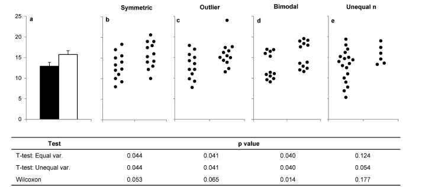

## 2.1 Expanding on research integrity

Last week we discussed the many responsibilities that researchers must uphold in their roles as outlined in the code (The National Health and Medical Research Council 2018).
These include:

* Compliance with rules around animal ethics, human ethics, biosafety and biosecurity, gene technology, radiation and control of dangerous goods.

* Legal issues such as:

    * Transparency around funding from external parties - for example from industry.
    
    * Respecting privacy of participants information
    
    * Respecting intellectual property rules

    * Data management and retention

* Honest collecting and reporting of research results

    * Avoid fabrication of data
    
    * Avoid leaving out data because they don’t fit
    
    * Avoid removing data points without substantiation
    
    * Manipulating or adding data points or removing unwanted results

    * Recording results in lab notebook accurately

* Avoiding questionable research practices

    * Improper use of statistics such as wrong tests or not checking validity for tests
    
    * Not validating reagents or protocols before undertaking such work

    * Keeping sloppy or incomplete notes

    * “Forgetting” to cite the research results of others that contradicts your own
    
    * Not reporting “null” or “negative” results when necessary
    
These are not hypothetical scenarios, they actually occur very frequently as scientific research has grown to become a large and competitive discipline.
To get some idea about the extent of the problem of research integrity, take some time and read this report published in 2005 (Martinson, Anderson and de Vries, 2005; listed in the bibliography), which used a survey to show that a surprisingly high level of misconduct is present.

According to the results of the survey by Martinson, Anderson and de Vries, we see that outright data fabrication and manipulation is relatively rare.
One must keep in mind that this is based on self-reporting so might not be an accurate representation.
Also the survey was focused on researchers in the USA whereas we know research is a global enterprise and that incentive structures in different jurisdictions might lead to different rates of compliance.
There have been some studies investigating anomalous data and images which shed light on this.
For example, a report shows that  approximately 3.8% of 20,621 articles that were screened showed evidence of inappropriate image duplication (Bik, Casadevall and Fang 2016). 

There are now established techniques for identifying fabricated data based on the notion that a decimal number is more likely to begin with a 1 or 2 rather than an 8 or 9.
This is called Benford’s law and it means that there is an expected frequency that numbers should appear if they are genuine and a deviation from this could be due to fabrication or manipulation (Collins 2017).
While this approach has been used to identify accounting fraud successfully, there are only a few cases where this has been shown to identify fabricated research data (eg: Marcus 2012).
Indeed, crafty fabrications by researchers who are aware of Benford’s law will no doubt come up with ways to avoid algorithmic detection.

Other issues are a bit more subtle and are worth expanding here.
They stem mostly from poor study design, cutting corners and inappropriately analysing data.
Some of these are summarised in this diagram of the research cycle (Munafò et al 2017). 


Failure to control for bias, low statistical power and poor quality control are fairly obvious, but p-hacking publication bias and HARKing are probably new to you.
“P-hacking refers to the conscious—or perhaps unconscious—manipulation of data until they become significant” (Head et al, 2015).
Gray (2019) describes some examples such as:

* Analyzing multiple measures but only reporting the ones that meet the significance threshold,

* Altering the statistical approach after data collected to one that gives a more “favourable” or  statistically significant result. For example by

    * Changing the type of statistical test

    * Changing the classification of outliers

    * Adding or removing covariates

* Another is the tendency to not have a set sample size, but to simply collect data until the p-value reaches the threshold.
This is a problem in clinical research because an initially small sample might give a false positive result, whereas the larger cohort gives a true non-significant result.

HARKing is “Hypothesizing After the Results are Known” or redefining the aims of the study after the results have been collected and analysed (Kerr 1998). 
This is problematic because it increases the risk that the null-hypothesis is rejected.
It leads to the unrealistic bias toward hypotheses being always confirmed instead of falsified.
HARKed studies are less likely to be replicated because the original design of the study was to test “X” but the journal article is focussed on a different surprise outcome “Y”.

The motivation behind p-hacking and HARKing is the same; authors believe they will get a better publication outcome if they make changes to the study aims and methods to make the results appear more striking and statistically significant.
Therefore the authors might get their article in a more prestigious journal and boost their career prospects.
This leads to not only to reduced reliability of the results in such cases, but an observable publication bias.
Publication bias is the observation that “null” or “negative” results are less often published than those studies showing an effect.
When a reader reviews many papers on a topic and they see that most studies appear to support some hypothesis they may come to the conclusion that the hypothesis is true, whereas in fact it is not the case in reality.

See below for a recent real life example via twitter (@nicholaraihani 2021).

Prof Nichola Raihani @nicholaraihani

> "Submitted a paper reporting null results to a mid tier journal. Guess how it went. I literally don’t care at this point but I do feel bad for the first author (who I won’t name here)."


Let’s talk about why this is a problem.
Take for example the case of a drug used to treat a disease.
If there are 10 parallel studies happening in different countries looking at the effectiveness of the drug, and out of those studies 4 gave a statistically significant improvement and 6 showed no effect, the decision of the 6 groups to publish or not to publish those results could be extremely important.
If they don’t publish, then the external reader will see four studies supporting and zero contradicting the hypothesis.
If they all publish, then the reader will see four studies supporting and six contradicting.
Again, the decision to publish or not is driven by incentives.
Why should the researchers invest time in writing and submitting the paper if they will have little chance of getting it into a high impact journal and improving their future career prospects?

To combat p-hacking, HARKing and publication bias, pre-registration of clinical research is now required in many places in the world.
This is a small publication that outlines the project aims, hypotheses and methods before any data is collected.
This ensures that HARKing and p-hacking are obvious and should give a reasonable estimate as to the extent of publication bias in a specific field.
While not yet mandated by the NHMRC for all projects, it is required for all clinical trials in Australia (National Health, Medical Research Council, 2016).

There are also cases where the decisions made around statistical analysis and reporting are driven by “how the data look”.
Take for example the choice of plot.
A barplot with upper error bar is the most common type but it hides a great deal of information about the data such as the number of observations, the modality, skew and spread.
To demonstrate this, consider the barplot below, which would be valid for the four hypothetical scenarios depicted (Weissgerber et al, 2017). 



If you are interested in further reading on this topic, consider reading the review by Brown, Kaiser and Allison (2018).
Next, we will be looking at some related case studies.

## 2.2 Case studies on research integrity

### 2.2.1 Research integrity scenario 1

You are a PhD Student whose scholarship stipend is paid  as part of a large grant from a pharmaceutical firm that also funds your supervisor’s laboratory. 
Your project involved testing a drug compound to see if it inhibits tumours in mice.
Your results look promising but you notice that 3 of 500 mice seem to have become disoriented and uncoordinated.
You tell your supervisor you’d like to investigate this further to see if there is any association with the drug. 
Your supervisor tells you not to, but to concentrate on the tumour reduction.
“Besides the company didn’t ask us to look for side effects and I don’t want to make them unhappy and risk losing the funding contract”

What should you do?

### 2.2.2 Research integrity scenario 1

Let’s now consider a case study about who qualifies for authorship. Research team:

* Prof Andrew Jones: Head of Research Centre funded by large grant

* Prof Xiao Chen: Co-investigator on grant

* A/Prof Melisa Canning: Co-investigator on grant and your supervisor

* Dr Rashmi Kumar: postdoc on grant, associate supervisor

* Dr Anthony Irvine: lecturer and associate supervisor

* Mr Alan Wilson: electron microscopy technician

**Scenario:**

You have some interesting results and A/Prof Canning suggests you publish.
The results were obtained by the preparation and characterisation of samples.
You did the preparations, under the guidance of A/Prof Canning and with some advice and assistance on techniques from Dr Kumar.
You did most of the characterisations, but Mr Alan Wilson from the Electron Microscopy unit produced the images on a fee for service basis.
You wrote the manuscript.
A/Prof Canning read it and made a lot of comments about its structure, so you had to make a lot of changes before she was satisfied.
Dr. Kumar also read the manuscript and made a couple of small but useful comments about how to present your data.
Dr Irvine said he was too busy to read the manuscript.

This is your first publication, and you are unsure about who should be an author.
On the manuscript you tentatively listed yourself, Mr Wilson, Dr Kumar, Dr Irvine and A/Prof Canning. When you discussed the manuscript with A/Prof Canning, she did not make any comments about this list of authors, and you did not ask her about it specifically.
But now you are a bit unsure

Who are  the correct authors of this study?

Hint: you can use the CRediT taxonomy to classify each person’s contribution (Journal of Cell Science, 2021)

### 2.2.3 Research integrity scenario 3

You are working on a social history project, A/Prof Canning is your principal supervisor and Dr Kumar your associate supervisor.
You are ready to submit your first journal article.
You wrote the manuscript. A/Prof Canning read it and made a lot of comments about its structure, so you had to make a lot of changes before she was satisfied.
Dr. Kumar also read the manuscript and made a couple of small but useful comments about how to present your data.

You have listed yourself as the sole author, with acknowledgments to A/Prof Canning and Dr Kumar for their assistance.
Is this correct?
Why is it different?

### 2.3 Research integrity versus research ethics, what’s the difference?

You might be feeling a bit confused about these two related topics, indeed according to the dictionary I’m using they are similes along with honesty, morality, probity and other words.

We are making this strong distinction because as researchers they are two different aspects to good research practice.
When we speak about research integrity, we are emphasising all the good practices mentioned in week 1:

* Conducting analysis according to best methodological practices

* Reporting data accurately and honestly

* Keeping good records, documentation and data

* Avoiding p-hacking and HARKing

* Being a good team player and contributing to a culture of good research practice

* Following guidelines around authorship

* Being transparent about actual, potential or perceived conflicts of interest.

On the other hand, research ethics has a very particular meaning as it relates to the wellbeing of the participants of the study.
For good reason there are strong rules that limit what we can do regarding human research and there are systems in place to ensure these rules are followed. This is also the case with studies involving animal research. 

In previous iterations of this unit, in assessment task 1 essay, some students made the severe mistake of not mentioning one of these aspects and lost a lot of marks.
I don’t want you to make the same mistake.
Therefore you need to mention the integrity and ethics points which are most relevant to your desired research field.
If your desired research field is plant biotechnology, then human and animal ethics is not going to be worth mentioning at all, so you can focus on the research integrity issues.
If you are looking to be involved in social psychology, then you must discuss issues related to human ethics as well as research integrity.
If your research direction is wildlife monitoring, then you must discuss issues related to animal ethics as well as research integrity.

Keep in mind, there are some other branches of research which have moral and ethical considerations such as artificial intelligence, weapons research and pathogen research but we will now only focus specifically on human and animal research as these are more likely to be part of your future research career (and assessment task 1).

##  2.4 The use of animals in research


Image Source: EVGENYI_EG/ISTOCK.COM https://www.sciencemag.org/news/2020/06/it-time-replace-one-cornerstones-animal-research.

In this lesson we will be discussing the ethical considerations of research involving animals.

Even if you won’t use animals in your own future research, it’s good to have a good grasp of their uses and limitations. In modern society as a whole animals are used in a variety of ways:

* Pets and companions

* Food products like meat, fish, eggs, dairy, honey, etc.

* Household products like cosmetics, soap and toothpaste

* Leather and other durable goods 

* Transport (horses)

* Entertainment (race horses and dogs, circus animals, zoos, etc)

* Medicines (eg: anti-venom)

* Medical research (direct and indirect)

    * Direct: like testing drugs/chemicals on animals

    * Indirect: like manufacturing research antibodies using rabbits, or fetal calf serum for culturing cells.

    * Training: surgeons practicing open-heart surgery on dogs

In the following, we will focus on direct use of animals in research with a view to help you to plan and undertake successful experiments. Animals are used in a wide array of disciplines including:

* Understanding human/animal biology

    * Psychology and cognition

    * Physiology

    * Anatomy

    * Genetics

* Animals as test models

    * Drug discovery and testing

    * Immunology and diseases

* Wildlike research

    * Behavioural ecology

    * Conservation

* Forensics

    * Entomology

Just in the field of biomedical research there have been major discoveries and medical advances that have been made possible with animal research:

1. Infectious diseases: Research involving monkeys was vital to the characterisation of the pathogen causing the disease by Landsteiner and Popper in 1908 (The College of Physicians of Philadelphia, 2021) as well as the successful vaccine development which became available to the public in 1955 (History.com editors, 2010). 

2. Diabetes: In the 1890s work by Von Merin and Minkowski in dogs led to the identification of the pancreas as the causative organ in diabetes. Later Banting and Macleod used pancreatic extracts from cows to treat diabetic rabbits, a proof of principle that led to a small but successful clinical trials in 1922 and commercial production in 1936.

There are many further examples at the FBR website (Foundation for Biomedical Research 2016).

On the other hand, there are those who believe that animal research is mostly unnecessary because there are viable alternatives including consenting humans and in (cell culture) vitro models. This has led to some animal research facilities being closed down (Hou 2019; Davey 2021).

There is an argument that the pain inflicted on animals is not commensurate with the knowledge gained, and so animal research should be stopped entirely. 
Indeed there are some previous examples where animal research has gone too far.

* Animals used to test the effects of tobacco did not represent a valid experimental model system of human disease (Stinn et al, 2005).

* Monkeys used for anti-gravity research (Milman 2020). Is it necessary?

* Growing a human ear on the back of a mouse (Briggs 2013). Is it contrived or a real advance? 

* Research paper contains images showing mice with large tumours which indicate severe suffering (Cressey 2015).

To combat animal cruelty in Australian research, a set of legislation was developed to govern the limits on how animals must be cared for and the NHMRC have developed very specific guidance and processes which have to be followed by every scientific organisation in Australia including private industry.

* Prevention of Cruelty to Animals Act 1986 (VIC)

* Prevention of Cruelty to Animals Regulations 2008 (VIC)

* Australian code for the care and use of animals for scientific purposes (8th Edition)

If the case study you were allocated involves animal ethics breaches, then you must read the Code (NHMRC 2021), but for the benefit of everyone else I have summarised the main points:

* Researchers need to be trained in how to plan and conduct animal experiments ethically. Only people with training can be involved in the research.

* Animals can’t tell us their concerns so they can’t opt in or out of a study. 

* When planning and conducting animal experiments we need to consider the welfare of the animal. It needs to be conducted to to minimise any harm, injury or pain.

* Ensure the research is justified, and that there is an urgent need for this research to be conducted. That is the animal model selected is justified and the methods are considered “best practice”

* Before animal research begins, the proposed activities need to be approved by an animal ethics committee.

* Animal health and wellbeing is monitored throughout the research. Research can be terminated if animals are experiencing adverse impacts (excess sickness, pain or suffering).

Each organisation will have policies and processes in place to facilitate animal research in a way which is compliant with the legislation and ethical guidelines.
This involves an approval process for many types of animal research by an animal ethics committee.
In this sense animal research is defined as any research where an animal is involved.
This could include the following types of activities:

* Housing and caring for animals.

* Performing experiments on animals.

* Obtaining materials from the animals such as blood samples.

* Trapping animals and attaching tracking devices.

* Observing animals, even in the wild.

Collection of faeces, food residues, hair/fur or observation of unused burrows or nests does not require prior approval. Observational studies with in situ cameras like go pros or drones requires prior approval. 

If you are using animal tissues from another institution or company it is required to retain records showing that these materials were collected under the approval process of another institution.
You will also be required to inform your department administration.
Even if you purchase materials from a commercial supplier eg: fishmonger, abattoir or butcher you will register these activities with the local department, but does not need to undergo ethics approval.

Not all experiments involving live animals require prior approval. This is decided by the types of animals used and their developmental stage. Let’s have a look at the animals that need prior approval:

* All fish and amphibians (that are capable of independent feeding)

* Mammals, birds and reptiles (above the midpoint in gestation)

* Adult decapod crustaceans (crabs, lobster and crayfish only)

* Adult cephalopods (such as octopus, squid and cuttlefish)

Now I will describe some exemptions to the list, where prior approval is not necessary.

* Fish that still have a yolk sac and are not feeding independently. 

* Embryos of mammals, birds and reptiles (we’ll talk about humans later).

* Juvenile crustaceans and cephalopods.

Other types of animals that don’t require prior approval include molluscs, sponges, nematodes, annelids, echinoderms, jellyfish and arthropods.

These guidelines are built around the idea that animals that can feel pain either physically or emotionally need to have the proposed experiments undergo an evaluation before they take place.
This evaluation process is conducted by an Animal Ethics Committee. This consists of a veterinary surgeon, experienced researcher, animal welfare advocate and a lay person.

These individuals need to be independent to the research group proposing the research and need to assess the proposed work objectively.
The committee decides whether to reject or approve the proposed works based on the balance of gained knowledge against the animal suffering involved.
In other words, they will decide whether the research is justified or not.
The committee uses the “Code” (Australian code for the care and use of animals for scientific purposes - 8th Edition) in their decision making process.
As you can see in the graphic below, the committee is critical to the governance of animal studies at an institution.

The main points that the committee are looking for are:

* Reduction - could this work be done with fewer animals?

* Replacement - could this work be conducted with a different system that doesn’t involve animals? If it needs to be done with animals, could a “lower” order animal suffice?

* Refinement - if animals must be used, are there any modifications we can make to the research that would reduce their suffering? 

The committee will review the documentation detailed experimental protocol and either approve or deny the application.
If denied, the committee will invite the research team to make the necessary changes to the application to meet the required standard.

```{r,diagram1,echo=FALSE}

library("DiagrammeR")
grViz("digraph flowchart {
      # node definitions with substituted label text
      node [fontname = Helvetica, shape = rectangle]        
      tab1 [label = '@@1']
      tab2 [label = '@@2']
      tab3 [label = '@@3']
      tab4 [label = '@@4']
      tab5 [label = '@@5']
      tab6 [label = '@@6']
      tab7 [label = '@@7']
      tab8 [label = '@@8']
      
      # edge definitions with the node IDs
      tab1 -> tab2 
      tab2 -> tab3
      tab2 -> tab4
      tab4 -> tab5  
      tab5 -> tab1 
      tab3 -> tab6 
      tab6 -> tab7
      tab7 -> tab2 
      tab6 -> tab8  ;
      }
      
      [1]: 'Draft animal ethics application'
      [2]: 'Ethics Committee Evaluation'
      [3]: 'Approved'
      [4]: 'Denied'
      [5]: 'Amend application'
      [6]: 'Go ahead (with monitoring)'
      [7]: 'Amendments needed'
      [8]: 'Complete research and submit final report'
      ")

```

After the application is finally approved, the research team needs to stick to the protocol which they originally described.
They are not allowed to make any changes to the procedures or methods unless that amendment is submitted to the committee again for approval.
As the approvals system is very slow (only 1 meeting per month) it is a good idea to spend time to consider all of the methods that will be required before the initial submission because amendments at a later time could cost the research team >1 month of delays.

While the experiments are underway, there will be monitoring of the animals by an animal technician who will be looking for signs of sickness, pain or suffering.
They may choose to euthanize the animals if they have any of these signs and terminate the research if animals are experiencing unexpected adverse impacts due to the experimentation.

If your research proposal in assessment task 2 involves some type of animal research, then it is important that you outline how you will obtain animal ethics approval before conducting the experiments.
This process will need to be included in the timeline as well.

Further reading: Grimm (2020): 

## 2.5 Case studies on animal ethics

Here we have some scenarios which are related to real-world cases. What would you do in each of these cases?

### 2.5.1 Animal ethics scenario 1

You are working in a group that is studying the role of sea jellies in the marine ecosystems around Victoria.
You have been hired to start a new project which involves setting traps at strategic locations and observing the traps remotely via a camera system, then harvesting the gut contents of the sea jellies for microbial analysis.

Now answer these questions:

* Will animal ethics approval be required to conduct this project? If so, which parts of the project are the most problematic?

* From a practical perspective, what should you do before undertaking this work?

### 2.5.2 Animal ethics scenario 2

You are working in a laboratory that is interested in the role of the Nfkb gene in the vascular system.
A researcher at another institute has mice with the Nfkb gene mutated and has offered to give you vascular endothelial cells to study in vitro. 

* Will you need animal ethics committee approval to undertake this experiment?

* From a practical perspective, what should you do before undertaking this work?

### 2.5.3 Animal ethics scenario 3

You are starting your masters project in aquaculture and your project involves working with an industry partner in optimising feed formulations to enhance product yield and quality.
You are going to trial the effect of added hormones into fish feed.
The industry partner (AquaFastFarm) wants to begin the experiments immediately because the fish will be spawning soon.
As the research is taking place on company property in New Zealand the project leader says not to worry about ethics approval at Deakin. 

* What is the correct course of action for the research student?

### 2.5.4 Animal ethics scenario 4

You have just begun work in a lab which is screening and developing anti-cancer drugs.
The model used involves tumours grown in culture being implanted under the skin in mice (xenograft).
Your project involves evaluating the effect of 10 different drugs which are all BET inhibitors (BETi1 to BETi10).
During the course of the study, it appears that BETi7 causes the tumours to increase in size to 5-10 times larger than that of the control group. 

What is the correct course of action?

### 2.6 Human research ethics

In this lesson we will be discussing the ethical considerations of research on humans.
Many books have been written on this topic, but I will try to focus as much as possible on the practical matters, emphasizing what you need to know in order to plan and undertake human research in Australia while being compliant with the laws and regulations.

Before we delve into the specifics of the strict legislation and guidelines we have nowadays around research involving humans, let’s take a historical perspective by reading the article on the topic by Bateman-House (2015).
As you can read from the article, there wasn’t a uniform set of principles and norms across disciplines in the period before the 1930’s and this led the medical and scientific researchers to “self regulate” which was not fully successful in protecting participants especially those in vulnerable situations.

As the horrors of human experimentation by the third reich were exposed, there was an outcry for stronger standards to govern medical research.
Read the short article by Mandal, Acharya and Parija (2011) which describes the importance of the Nuremberg Code and Declaration of Helsinki for guiding the current laws and guidelines.

The guidelines for human research we work under now are defined by the National Statement on Ethical Conduct in Human Research (2007) - Updated 2018. This is a wide-ranging document so I don’t expect you to read it in detail, unless your case study for assignment 1 involves human research ethics violations. This document includes guidelines for the:

* Ethical design and planning of experiments and projects

* Conduct of this research 

* Dissemination of results

There are four major principles that researchers need to abide by:

1. Respect for people - participants must give informed consent to be involved.
They need to understand the risks and benefits involved.

2. Beneficence - participants should not experience negative impacts caused by the research (even if  they consent).
In short, do no harm.

3. Justice - The impacts (both positive and negative) should not unfairly target specific segments of society.
For example, vulnerable populations like prison inmates, orphans or poor people should not be subjected to experimentation when the rich and privileged in society will realise the benefits of the research.
In short, don’t exploit people.

4. Merit and integrity.
Research integrity we have already covered in the unit.
Merit refers to whether the outcomes of the research justify the inconvenience, discomfort or potential suffering of the participants.

Human research involves many different forms of research:

* Surveys, interviews, focus groups

* Observational studies for example behavioural analysis of children

* Accessing personal information or materials, for example medical records.

* Collection and reuse of body fluids, organs, tissue, exhaled breath, biometric data like fingerprints, facial images, etc

* Access and reuse of identifiable database information, for example electoral roll.

* Psychological physiological or medical testing treatment, for example a clinical trial for a new drug or therapy.

As you can imagine, the risk profile for these different research activities varies greatly.
With surveys and data reuse having relatively lower risk as compared to trials of experimental therapeutics.
Therefore there are different tiers of approval processes for conducting these different types of experiments, with higher risk research undergoing a more rigorous approvals process. 

Here is a guide for different levels of approvals:

* Exempt human research.
This type of research involves analysis of pre-existing and non-identifiable human data.
It is considered to have negligible risk to the participants.
If the data is not publicly available, then the host institution might still require an application for an exemption (like Deakin).
Although the research is exempt from approvals, there are still some rules governing the use of the data.
For example, the research team should not attempt to re-identify the participants.

* Low risk research.
Is defined as research in which the only foreseeable risk to the participants is one of discomfort or inconvenience.
At Deakin low risk research is reviewed by Human Ethics Advisory Groups of trained academic staff in each faculty.
This type of approval is appropriate for surveys and interviews.
If the research is focused on vulnerable groups like children, ethnic minorities, or if the survey involves highly personal questions such as sexual activity, previous involvement in crimes, then it does not qualify as low risk research.

* Higher than low risk research.
May include collecting specimens from participants, performing genetic analysis, enrolling them in a specific exercise or diet regime.
If the study focuses on vulnerable groups such as children, prison inmates, victims of crime, hospital patients, unemployed, ethnic minorities, or the study is focused on collecting sensitive information such as sexual matters of involvement in crimes or previous drug use then there needs to be substantiation provided.
As this type of research has a higher risk profile than low risk research, the approvals process is more rigorous.
At Deakin, The Deakin University Human Research Ethics Committee (DUHREC) is responsible for evaluating all proposed studies in this category. 

* Clinical trials.
As this type of research has a higher risk of injury to the participants, these undergo an even higher level of scrutiny.
These are rarely led by Deakin researchers, rather these types of projects are applied through hospitals Human Research Ethics Committees. 

Deakin has extensive information on human research ethics procedures on the webpage (here).
Researchers looking to apply for human research approval will also need to undergo training before being allowed to submit an ethics application.
The ethics application requires different parts. 

* Standard form - Which gives the details about who will be running the research, when it will start and end, which institutes will be involved, the title of the project and a short description of what the research will involve.

* Plain language statement - This is a short document (up to 500 words) that describes the purpose of the research project in simple language that will be understood by the general public.

* Consent form - This is the form that potential participants will read and sign to give their approval.
It could be written or electronic. There also needs to be a mechanism so that participants can change their mind and withdraw if possible.
If the survey is completely anonymous and participant identities are not retained, then it is not possible to withdraw someone from the survey.
There also needs to be contact information for the research team in case potential participants have questions, as well as contact information for the Human Ethics Review Committee in case of complaints and feedback about the project.

* Protocol - This includes all procedures that will be followed by the research team. For a survey this typically includes:

    * How the participants will be recruited, including copies of any advertising or promotional materials and a transcript of a script that would be used on the radio or telephone to recruit participants into the study.

    * A copy of the questionnaire or survey that participants will complete.

    * Procedures in case of adverse impact, such as participant 

    * Procedures detailing how the data will be managed, stored, analysed in keeping with privacy laws.
    There may be a need to provide protocols for de-identification of participants and a protocol for destroying identifiable data at the end of the project.

    * If the study involves collection of biospecimens, then there needs to be a protocol for the collection and storage of those specimens as well as the conditions that they can be shared with other researchers and the methods of destruction and disposal if they won’t be indefinitely retained or the participant has decided to withdraw.

One of the most important aspects to human ethics applications is protecting participant privacy.
This is protected by legislation at the Commonwealth and State levels.
During a research project you are likely to collect some identifying information such as name, address, phone number, name and also some responses to survey questions.
These questions might ask about family history of a disease, ethnicity, and other topics that are personal or sensitive. You can imagine that if this information were to be made public it would have massively detrimental effects to the participants and also to the research institute in question. 

Data leaks such as this need to be actively avoided by using best practice for data management. Some of these are:

* If possible, make the project participants anonymous and do not collect any identifying information.

* If collecting personal information, be extremely careful with it. 

    * If they are written records, then be sure to keep them under lock and key on the institute premises.
    Even better is to deposit the document to the institutional archive.

    * Similarly, electronic files should be stored on premises and not taken home. Store the original data in the institutional research data store.
    If data needs to be uploaded to the cloud or shared with others in the research team, make sure that the participant’s identifying information has been removed and the participants are de-identified.

    * Do not share identifiable information with anyone outside of the research team
    
If your research project involves genetic analysis be wary that the results may have an impact on the blood relatives who are genetically related.

If your research project proposal in assignment 2 involves human ethics approval, it is expected that you describe what approvals you will obtain and how this fits into the project timeline.

## 2.7 Case studies in human research

### 2.7.1 Human ethics scenario 1

Read the Wikipedia entry about the Stanford prison experiment (Wikipedia contributors 2021).

* Do you think the risks to the participants were justified by the knowledge gained in the experiment?

* Were any of the four major principles violated by the research team leaders?

* Do you think the correct procedures were in place at Stanford and how do you think they could be improved?

### 2.7.2 Human ethics scenario 2

You are starting a new research project into the history of opium dens in Melbourne.
Your supervisor wants you to research documents and museum specimens from the 19th century and get in touch by phone with specific families whose ancestors were supposed to be involved in opium dens at the time. 

* Will you need human ethics committee approval to undertake this project?

* From a practical perspective, what should you do before undertaking this work?

### 2.7.3 Human ethics scenario 3

You are involved in a project to test a novel genomic sequencing technology.
You decided to use DNA samples which you have in the lab already including your own DNA and DNA from some HeLa cells.
At the end of the project you uploaded the sequencing data and results to The National Center for Biotechnology Information because that is required by the journal.
You didn’t apply for human ethics approval because this was your own DNA and the cells have been used in the laboratory for years.

After the journal article was published, you received a phone call from the Dean of the faculty saying your employment contract was terminated for human ethics breaches. What did you do wrong?

### 2.7.4 Human ethics scenario 4

You are undertaking a new project to study whether programs such as Clean Up Australia Day are having a positive effect on the environment.
In that project you will be requesting information from the Clean Up Australia Day organisation about the geographical locations where clean-ups are taking place.
After collecting this information, you take before and after photographs of these locations and collate results for publication.

* What type of human ethics applications will be necessary for this research project?

### 2.7.5 Human ethics scenario 5

Teaching staff in the unit SLE339 run an informal student survey at the end of trimester asking students about the best and worst aspects of the unit and how it can be improved.

Does this need Human Research Ethics approval? Why?

## Reference List

Author contributions: CRediT taxonomy. (2021). Retrieved July 12, 2021, from Journal of Cell Science website: https://journals.biologists.com/jcs/pages/author-contributions

Bateman-House, A. (2015, June 9). Even without written codes, ethical standards for human research existed before World War II. The Conversation. Retrieved from http://theconversation.com/even-without-written-codes-ethical-standards-for-human-research-existed-before-world-war-ii-41219

Bik, E. M., Casadevall, A., & Fang, F. C. (2016). The prevalence of inappropriate image duplication in biomedical research publications. MBio, 7(3). doi:10.1128/mBio.00809-16

Briggs, H. (2013, July 31). Artificial human ear grown in lab. BBC. Retrieved from https://www.bbc.com/news/health-23508688

Brown, A. W., Kaiser, K. A., & Allison, D. B. (2018). Issues with data and analyses: Errors, underlying themes, and potential solutions. Proceedings of the National Academy of Sciences of the United States of America, 115(11), 2563–2570.

Collins, J. C. (2017, April 1). Using Excel and Benford’s Law to detect fraud. Retrieved July 12, 2021, from Journal of Accountancy website: https://www.journalofaccountancy.com/issues/2017/apr/excel-and-benfords-law-to-detect-fraud.html

Cressey, D. (2015). Welfare breach prompts Nature to update policy on publishing animal experiments. Nature. doi:10.1038/nature.2015.18384

Davey, M. (2021, July 8). Australian supplier of lab animals to close, sparking fresh debate about use of mice and rats in research. The Guardian. Retrieved from http://www.theguardian.com/australia-news/2021/jul/09/australian-supplier-of-lab-animals-to-close-sparking-fresh-debate-about-use-of-mice-and-rats-in-research

Editor. (2013, November 12). Animal research and diabetes: Now the truth must be told – Part 1. Retrieved July 14, 2021, from Speakingofresearch.com website: https://speakingofresearch.com/2013/11/12/animal-research-and-diabetes-now-the-truth-must-be-told/

Foundation for Biomedical Research. (2016, April 15). Animal research achievements. Retrieved July 14, 2021, from Fbresearch.org website: https://fbresearch.org/medical-advances/animal-research-achievements/

Gray, R. (2019). Questionable research practices in nursing science: .05 shades of grey. Nurse Author & Editor, 29(2), 1–7.

Grimm, D. (2020). Is it time to replace one of the cornerstones of animal research? Science (New York, N.Y.). doi:10.1126/science.abd5197

Head, M. L., Holman, L., Lanfear, R., Kahn, A. T., & Jennions, M. D. (2015). The extent and consequences of p-hacking in science. PLoS Biology, 13(3), e1002106.

History.com Editors. (2010, February 9). Dr. Jonas Salk announces polio vaccine. Retrieved July 14, 2021, from HISTORY website: https://www.history.com/this-day-in-history/salk-announces-polio-vaccine

Hou, C.-Y. (2019, June 10). Wellcome Sanger institute to close animal facility. Retrieved July 13, 2021, from The-scientist.com website: https://www.the-scientist.com/news-opinion/wellcome-sanger-institute-to-close-animal-facility-65990

Kerr, N. L. (1998). HARKing: hypothesizing after the results are known. Personality and Social Psychology Review: An Official Journal of the Society for Personality and Social Psychology, Inc, 2(3), 196–217.

Mandal, J., Acharya, S., & Parija, S. C. (2011). Ethics in human research. Tropical Parasitology, 1(1), 2–3.

Marcus, A. (2012, June 26). Is post-hoc statistical analysis the new fraud detection tool? A new review looks at fraudster Reuben’s work. Retrieved July 12, 2021, from Retractionwatch.com website: https://retractionwatch.com/2012/06/26/is-post-hoc-statistical-analysis-the-new-fraud-detection-tool-a-new-review-looks-at-fraudster-reubens-work/

Martinson, B. C., Anderson, M. S., & de Vries, R. (2005). Scientists behaving badly. Nature, 435(7043), 737–738.

Milman, O. (2020, December 22). Revealed: all 27 monkeys held at Nasa research center killed on single day in 2019. The Guardian. Retrieved from http://www.theguardian.com/world/2020/dec/22/nasa-killed-all-monkeys-on-single-day

Munafò, M. R., Nosek, B. A., Bishop, D. V. M., Button, K. S., Chambers, C. D., du Sert, N. P., … Ioannidis, J. P. A. (2017). A manifesto for reproducible science. Nature Human Behaviour, 1(1), 0021.

National Health and Medical Research Council. (2018a). Australian Code for the Responsible Conduct of Research. Retrieved July 12, 2021, from Australian Code for the Responsible Conduct of Research, 2018 website: https://www.nhmrc.gov.au/about-us/publications/australian-code-responsible-conduct-research-2018

National Health and Medical Research Council. (2018b). National Statement on Ethical Conduct in Human Research (2007) - Updated 2018. Retrieved July 13, 2021, from Gov.au website: https://www.nhmrc.gov.au/about-us/publications/national-statement-ethical-conduct-human-research-2007-updated-2018

National Health and Medical Research Council (NHMRC). (2021). Australian code for the care and use of animals for scientific purposes. Retrieved July 12, 2021, from National Health and Medical Research Council (NHMRC) website: https://www.nhmrc.gov.au/about-us/publications/australian-code-care-and-use-animals-scientific-purposes

National Health, Medical Research Council, Department of Industry, & Science. (2016). Trial registration. Retrieved July 12, 2021, from Gov.au website: https://www.australianclinicaltrials.gov.au/trial-registration

@nicholaraihani, P. N. R. (2021, Summer 7). No title. Retrieved July 16, 2021, from Twitter.com website: https://twitter.com/nicholaraihani/status/1415308025179656194

Stinn, W., Teredesai, A., Anskeit, E., Rustemeier, K., Schepers, G., Schnell, P., … Reininghaus, W. (2005). Chronic nose-only inhalation study in rats, comparing room-aged sidestream cigarette smoke and diesel engine exhaust. Inhalation Toxicology, 17(11), 549–576.

The College of Physicians of Philadelphia. (2021). Poliovirus Identified. Retrieved July 14, 2021, from Historyofvaccines.org website: https://www.historyofvaccines.org/content/poliovirus-identified

Weissgerber, T. L., Savic, M., Winham, S. J., Stanisavljevic, D., Garovic, V. D., & Milic, N. M. (2017). Data visualization, bar naked: A free tool for creating interactive graphics. The Journal of Biological Chemistry, 292(50), 20592–20598.

Wikipedia contributors. (2021, July 1). Stanford prison experiment. Retrieved July 14, 2021, from Wikipedia, The Free Encyclopedia website: https://en.wikipedia.org/w/index.php?title=Stanford_prison_experiment&oldid=1031319396
